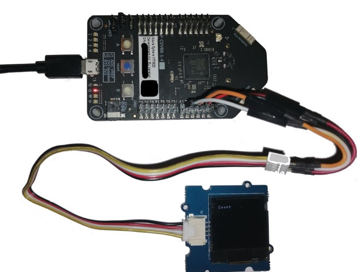
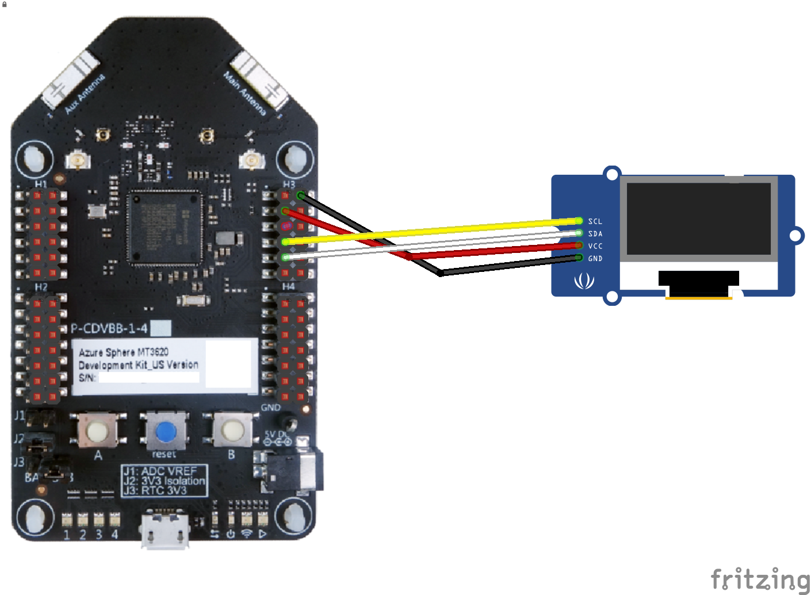

# SeedOledV11_I2C

Implementing a basic counter printin on OLED display.

## Hardware

Display is I2C an oled 128x128 display (Seed Oled 1.12" v1.1  with SH1107G chip driver)
 
__/!\\ : I ordered a V1.0,but i received a v1.1 (look like a V1.0 but behave like a V2.x)__ ... _Time lost :(_

Oled is connected to the onboard I2C bus (ISU port 3) on the Azure Sphere Reference Dev Board.



Screen management methods used the Seed Grove Library sample, with  I2C read/write method updated to use onboard ISU3.

## Wiring


## Manifest
* __I2cMaster__ : ISU3

## Program

The code is a basic numeric counter, increment every second. 
Counter value is printed at the top of Screen. 

I2C code :
* I2C initialisation in _main.c_

* write i2c data in _SeedOledDiplay.c_
```C
static void sendData(uint8_t data) { /* ... */ }
static void sendCommand(uint8_t cmd) { /* ... */ }
```

